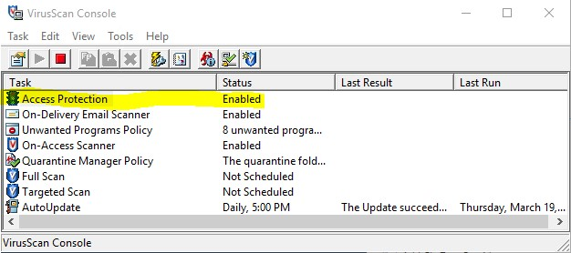
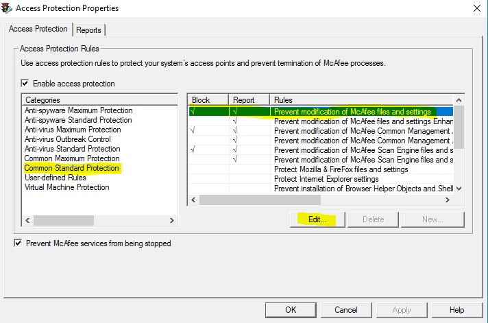
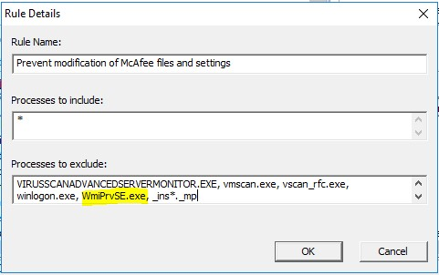

# McAfee

A composite DSC resource to manage the Mcafee VirusScan STIG settings

## Requirements

None

## Parameters

| Parameter | Attribute | DataType | Description | Allowed Values |
| --------- | --------- | -------- | ----------- | -------------- |
| TechnologyRole | True | String | The role of the Mcafee technology STIG to apply and monitor | VirusScan |
| Version | True | String | The version number of the McAfee technology | 8.8 |
| StigVersion | False | Version | If this parameter is not provided, the most recent version of the STIG is automatically selected. | 5.16 |
| Exception | False | PSObject | A hashtable of @{StigId = @{Property = 'Value'}} that is injected into the STIG data and applied to the target node. |  |
| OrgSettings | False | PSObject | The path to the xml file that contains the local organizations preferred settings for STIG items that have allowable ranges. |  |
| SkipRule | False | PSObject | The SkipRule Node is injected into the STIG data and applied to the taget node. The title of STIG settings are tagged with the text 'Skip' to identify the skips to policy across the data center when you centralize DSC log collection. |  |
| SkipRuleType | False | PSObject | All STIG rule IDs of the specified type are collected in an array and passed to the Skip-Rule function. Each rule follows the same process as the SkipRule parameter. |  |

## Examples

### Apply the McAfee VirusScan STIG V5R16 to a node

```PowerShell
<#
    Use the embedded STIG data with default range values to apply the most recent STIG settings.
    The composite resource merges in the default values for any settings that have a valid range.
#>
configuration Example
{
    param
    (
        [parameter()]
        [string]
        $NodeName = 'localhost'
    )

    Import-DscResource -ModuleName PowerStig

    Node $NodeName
    {
        Mcafee BaseLine
        {
            TechnologyRole = 'VirusScan'
            Version       = '8.8'
            StigVersion   = '5.16'
        }
    }
}

Example
```

### Apply the Mcafee VirusScan STIG to a node, but override a rule value

```PowerShell
<#
    Use embedded STIG data and inject exception data.
    In this example, the McAfee VirusScan STIG is
    processed by the composite resource and merges in the default values for any
    settings that have a valid range. Additionally, an exception is added inline
    to the configuration, so that the setting in STIG ID V-1075 would be over
    written with the value 1.
#>

configuration Example
{
    param
    (
        [parameter()]
        [string]
        $NodeName = 'localhost'
    )

    Import-DscResource -ModuleName PowerStig

    Node $NodeName
    {
        Mcafee BaseLine
        {
            TechnologyRole = 'VirusScan'
            Version        = '8.8'
            Exception      = @{'V-14621'= @{ValueData ='0'} }
        }
    }
}

Example
```

### Apply the Mcafee VirusScan STIG to a node, but override the default organizational settings with a local file

```PowerShell
<#
    Provide an organizational range xml file to merge into the main STIG settings.
    In this example, the Mcafee VirusScan STIG is processed
    by the composite resource. Instead of merging in the default values for any settings
    that have a valid range, the organization has provided a list of values to merge
    into the valid ranges.
#>

# Creates a sample Organizational Settings file for the example to use.
function New-OrgSettingXmlFile
{
@"
<?xml version="1.0"?>
<!-- The organizational settings file is used to define the local organizations preferred setting within an allowed range of the STIG. Each setting in this file is linked by STIG ID and the valid range is in an associated comment. -->
<OrganizationalSettings version="2.12">
    <OrganizationalSetting id="V-14620" ValueData="30" />
    <!-- Ensure 'V-35027.b' -match 2|3|4 -->
    <OrganizationalSetting id="V-35027.b" ValueData="2" />
    <!-- Ensure 'V-42569.b' -match 2|3|4 -->
    <OrganizationalSetting id="V-42569.b" ValueData="4" />
    <!-- Ensure Configured to the ISSO, ISSM,ePO Administrator, or System Administrator -->
    <OrganizationalSetting id="V-42570.b" ValueData="User@domain.com" />
</OrganizationalSettings>
"@ | Out-File -FilePath "$PSScriptRoot\orgsettings.xml"
}

configuration Example
{
    param
    (
        [parameter()]
        [string]
        $NodeName = 'localhost'
    )

    Import-DscResource -ModuleName PowerStig

    Node $NodeName
    {
        Mcafee BaseLine
        {
            TechnologyRole = 'VirusScan'
            Version        = '8.8'
            OrgSettings    = "$PSScriptRoot\orgsettings.xml"
        }
    }
}

New-OrgSettingXmlFile

Example
```

### Apply the Mcafee VirusScan STIG to a node, but skip a specific rule

```PowerShell
<#
    Use embedded STIG data and inject a skipped rule. In this example,
    the Mcafee VirusScan STIG is processed
    by the composite resource and merges in the default values for any
    settings that have a valid range. Additionally, a skip is added
    inline to the configuration, so that the setting in STIG ID V-1075
    would be marked to skip configuration when applied.
#>

configuration Example
{
    param
    (
        [parameter()]
        [string]
        $NodeName = 'localhost'
    )

    Import-DscResource -ModuleName PowerStig

    Node $NodeName
    {
        WindowsServer BaseLine
        {
            TechnologyRole = 'VirusScan'
            Version        = '8.8'
            SkipRule       = 'V-14620'
        }
    }
}

Example
```
## Managing a System with DSC while "On Access Protection" is enabled
The VirusScan STIG enables "On Accesss Protection", which in turn disables DSC's ability to make changes to McAfee keys in the registry. In order to maintain/change settings in the registry with DSC, a modification must be made to the Access Protection settings within the VirusScan console.

* Open Virus Console and Navigate to right-click on "Access Protection"



* Navigate to "Common Standard Protection", "Prevent Modification of McAfee files and settings", and select "Edit"



* Add "WmiPrvSE.exe" to "Processes to Exclude", and select "Ok"

