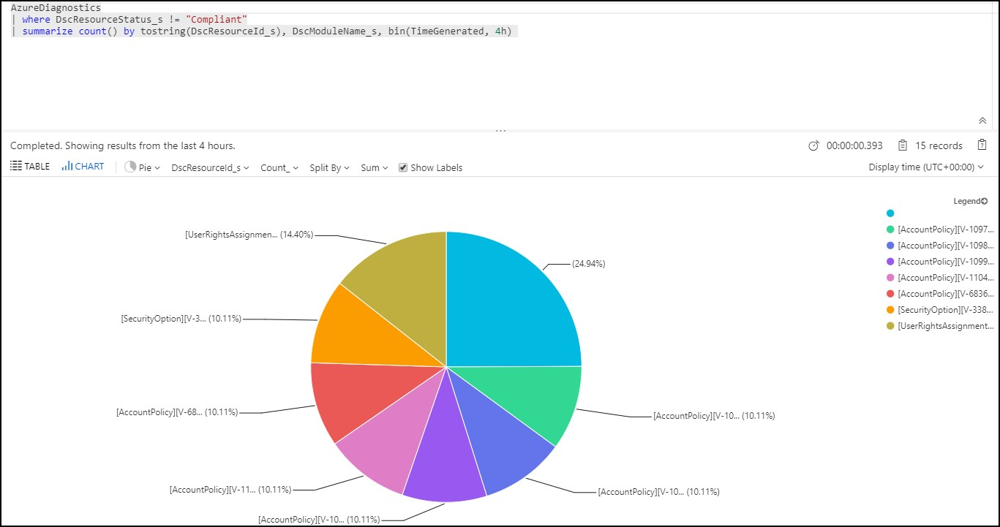
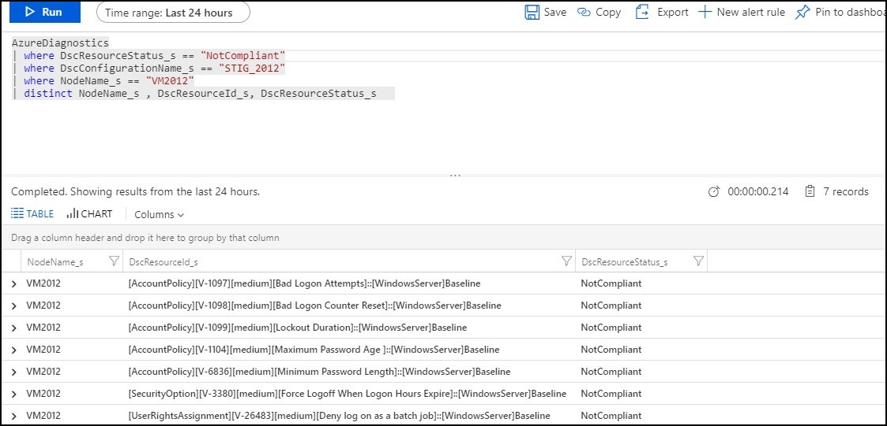

## PowerSTIG and Azure Automation
PowerSTIG paired with Azure Automation enables better insight into the DSC status of nodes, reporting and visualization of data when logs are fowarded to Log Analytics. 

## Importing Required Modules into Azure Automation Environment 
PowerSTIG (3.3.0) has several modules dependenies that will need to be imported into an Azure automation environment before the PowerSTIG module can be imported. 

**Note:** Currently there is a known issue with Azure Automation when importing the PowerSTIG module directly from the Azure Portal. In order to work around this limitation, the required dependencies must be imported using PowerShell or an ARM template. 

* Manage Modules in Azure Automation: https://docs.microsoft.com/en-us/azure/automation/shared-resources/modules

* Example ARM template that can be used to import the PowerSTIG module and require dependencies:  https://github.com/mikedzikowski/azure-import-powerstig-azureautomation   

* UserVoice feedback and votes can be added here:  https://feedback.azure.com/forums/246290-automation/suggestions/38561443-powerstig-module-import-in-azure-automation 

**Dependencies:** 
* AuditPolicyDsc RequiredVersion: 1.2.0
* AuditSystemDsc  RequiredVersion: 1.0.0
* AccessControlDsc RequiredVersion: 1.4.0
* ComputerManagementDsc RequiredVersion: 6.2.0
* FileContentDsc RequiredVersion: 1.1.0.108
* PolicyFileEditor RequiredVersion: 3.0.1
* PSDscResources RequiredVersion: 2.10.0.0
* SecurityPolicyDsc RequiredVersion: 2.4.0.0
* SqlServerDsc RequiredVersion: 12.1.0.0
* WindowsDefenderDsc RequiredVersion: 1.0.0.0
* xWebAdministration RequiredVersion: 2.5.0.0
* xDnsServer RequiredVersion: 1.11.0.0

## Example PowerShell that may be used to import PowerSTIG dependencies

The following PowerShell will script will import the PowerSTIG dependencies into an existing Azure Automation environment. 

```powershell
[CmdletBinding()] 
param 
(  
    [parameter(mandatory=$true)]
    [string]$resourceGroupName,
    [parameter(mandatory=$true)]
    [string]$automationAccountName
) 
#region Login to Azure
try
{
    write-output "Logging in to Azure..." 
    $env = read-host "Please select an Azure Environment   1: Azure Government  or  2: Azure Commercial"
    if ($env -eq 1)
    {    
        Add-AzAccount -EnvironmentName "AzureUSGovernment" | Out-Null
    }
    elseif ($env -eq 2)
    {
        Add-AzAccount | Out-Null
    }
    else
    {
        throw "Please enter 1 for Azure Government and 2 for Azure Commercial"
    }
}
catch {
    Write-Error -Message $_.Exception
    throw $_.Exception
}

# Find PowerSTIG module 
try 
{    
    $powerStig = (Get-module -Name PowerSTIG -ListAvailable)

    if(!$powerStig)
    {
        Import-Module -Name PowerSTIG
        $powerStig = (Get-module -Name PowerSTIG -ListAvailable)
    }
}
catch 
{
    Write-Error -Message $_.Exception
    throw $_.Exception
}

# Find the required modules for PowerSTIG
$requiredModules = (Import-PowerShellDataFile -Path (Get-Module PowerSTIG -list).path).RequiredModules 

# Create empty hashtable 
$dependencies = @()

# Add the modules to an hashtable 
foreach($module in $requiredModules)
{
    $dependencies +=  @{ModuleName = $module.ModuleName; RequiredVersion = $module.ModuleVersion; }
}

#region Import PowerSTIG dependencies and PowerSTIG version 3.3.0
foreach($dependency in $dependencies)
{
    $galleryRepoUri = "https://www.powershellgallery.com/api/v2/package/" + $dependency.ModuleName + "/" + $dependency.RequiredVersion
    $galleryRepoUri
    New-AzAutomationModule -ResourceGroupName $resourceGroupName -AutomationAccountName $automationAccountName -Name $dependency.ModuleName -ContentLink $galleryRepoUri
}
# Import PowerSTIG into Azure Automation
if($powerStig)
{
    $galleryRepoUri = "https://www.powershellgallery.com/api/v2/package/" + $powerStig.Name + "/" + $powerStig.Version
    $galleryRepoUri
    New-AzAutomationModule -ResourceGroupName $resourceGroupName -AutomationAccountName $automationAccountName -Name $powerStig.Name -ContentLink $galleryRepoUri
}
else 
{
    write-host "Please Install PowerSTIG by running: Install-Module -Name PowerStig -Scope CurrentUser"
}
#endregion  
``` 

## Importing PowerSTIG Desired State Configuration (DSC) into Azure Automation
```powershell
[CmdletBinding()] 
param 
(  
    [parameter(mandatory=$true)]
    [string]$resourceGroupName,
    [parameter(mandatory=$true)]
    [string]$automationAccountName,
    [parameter(mandatory=$true)]
    [string]$sourcePath
) 
try 
{
    Import-AzAutomationDscConfiguration -AutomationAccountName $automationAccountName -ResourceGroupName $resourceGroupName -SourcePath $sourcePath -Force
}
catch
{
    Write-Error -Message $_.Exception
    throw $_.Exception
}
```

For additional details on the Import-AzAutomationDscConfiguration cmdlet please reference the following link: 
https://docs.microsoft.com/en-us/powershell/module/az.automation/import-azautomationdscconfiguration?view=azps-2.6.0

## Azure Automation Desired State Configuration Onboarding 

To onboard a machine for management by Azure Automation State Configuration please referece the following documentation: https://docs.microsoft.com/en-us/azure/automation/automation-dsc-onboarding 

## Forwarding Azure Automation Desired State Configuration Status Using Log Analytics

Data from Azure State Configuration can be forwarded to Log Analytics. The following link provides the steps required to configure log fowarding for DSC configurations. 

Azure State Configuration data can be fowarded by following this set of documentation: https://docs.microsoft.com/en-us/azure/automation/automation-dsc-diagnostics 

## Sample Queries for Reporting on Desired State Configuration Status with Log Analytics

* Find all resources that are not compliant 
```powershell
AzureDiagnostics
| where DscResourceStatus_s != "Compliant"
| summarize count() by tostring(DscResourceId_s), DscModuleName_s, bin(TimeGenerated, 4h) 
``` 


* Find all DSC resources that are not complaint per node
```powershell
AzureDiagnostics
| where DscResourceStatus_s == "NotCompliant"
| where DscConfigurationName_s == <DSC CONFIGURATION NAME>
| where NodeName_s == <NODE NAME>
| distinct NodeName_s , DscResourceId_s, DscResourceStatus_s   
``` 
